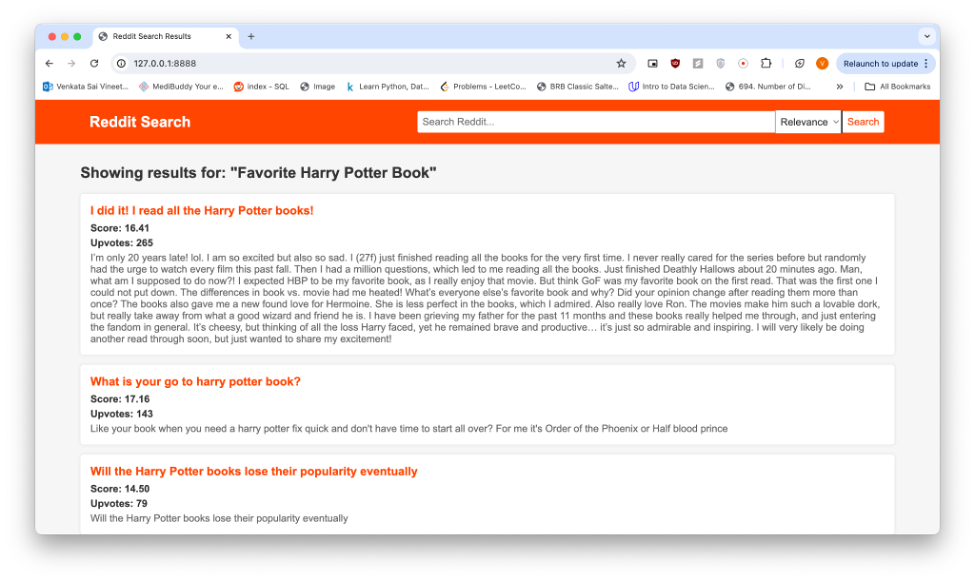

## Reddit search engine web application

### There are three stages in this application. Crawling, Indexing and Retrieving

#### Stage 1 - Crawling: 
1. The first stage involves crawling the data from the subreddits using PRAW which is a python reddit API wrapper.
2. I have created a shell script crawler.sh which in turn calls the reddit_crawler.py. You can pass the subreddits which you want to call as arguments while executing the shell script. The script supports multithreading, which enhances the efficiency of data fetching by processing multiple threads in parallel.
3. The script fetches top posts from the specified subreddits using the Reddit API. We can also specify the number of posts to fetch per subreddit, and the depth of comment threads to explore.

#### Stage 2 - Indexing:
1. For indexing PyLucene was used, which is a Python extension for the Apache Lucene search engine library written in Java. 
2. PyLucene allows to create custom analyzers to handle specific text processing such as stemming, tokenization etc.
3. create_index.py reads the reddit text files present in the reddit_data/ folder and is used for index creation based on the selected fields.

#### Stage 3 - Retrieving:

1. PyLucene helps in quickly retrieving information from large datasets based on text queries. It also gives a match score which indicates how well the document matches with the user input query.

2. The search functionality is built upon Apache Lucene's robust search mechanisms, enhanced by customized sorting capabilities.

3. The Upvotes option sorts Reddit posts based on the number of upvotes the post has. The Relevance option uses a custom ranking function which I have created to sort posts by how closely they match the search keywords. The Popularity option sorts posts by the number of comments they have, highlighting the most discussed content.

### Overview of the directories/files

1. main.py: The main entry point for the Flask application, setting up the server and initializing all routes and configurations necessary for the web application.

2. reddit_data/: The folder to store all the crawled reddit data text files, which serve as the data source for Lucene indexing. Each text file includes raw Reddit post data, such as title, body, link to the reddit post, upvotes, and comments.

3. lucene_code/: Contains the files related to lucene indexing.

4. lucene_code/create_index.py: Creates and configures the Lucene index, defining fields such as username, timestamp, and content, allowing for efficient search operations. By organizing data in a structured manner, it allows for efficient and rapid search operations.

5. lucene_code/lucene_index/: Directory where Lucene's index files are stored, facilitating quick data retrieval during search operations.

6. website/retrieve_data.py: Acts as the data access layer, using Apache Lucene to fetch and process data for indexing and query responses. It ensures efficient retrieval of relevant Reddit posts based on user queries.

7. website/views.py: Orchestrates data flow between the web interface and the backend logic, ensuring data is correctly passed to templates for rendering. It manages the routes and controls the display of search results to the user.

8. website/static/: Contains CSS files for web interface styling, ensuring a consistent and responsive design.

9. website/templates/: Houses HTML files (home.html, search.html) that define the structure and layout of the web pages. Using Jinja2 for dynamic content rendering, it integrates data into the HTML to display search results and other information.

### Usage:
1. Crawling the data from reddit - 
./crawler.sh --subreddits subreddit1 subreddit2 --limit 100 --depth 5
2. Creating the index - 
python3 create_index.py
3. To get the flask app running - 
python3 main.py

### Screenshots showing the system in action.

1. The homepage of our Flask web application, a Reddit search engine, contains a search bar where users can enter queries to find Reddit posts. Adjacent to the search bar, a drop-down menu is given which allows users to sort results by upvotes, relevance, or popularity. 

2. The results page of our Reddit search engine displays the top 20 matching Reddit posts based on the user's query. Each post is presented with its title, which is a clickable link redirecting users to the original Reddit post. Alongside the title, the body of the post is shown to provide context. Additionally, each post includes a match score, derived from Lucene, to indicate its relevance to the query, and the number of upvotes to highlight its popularity. This will ensure the users can quickly assess and navigate to the most relevant and popular posts related to their search.
