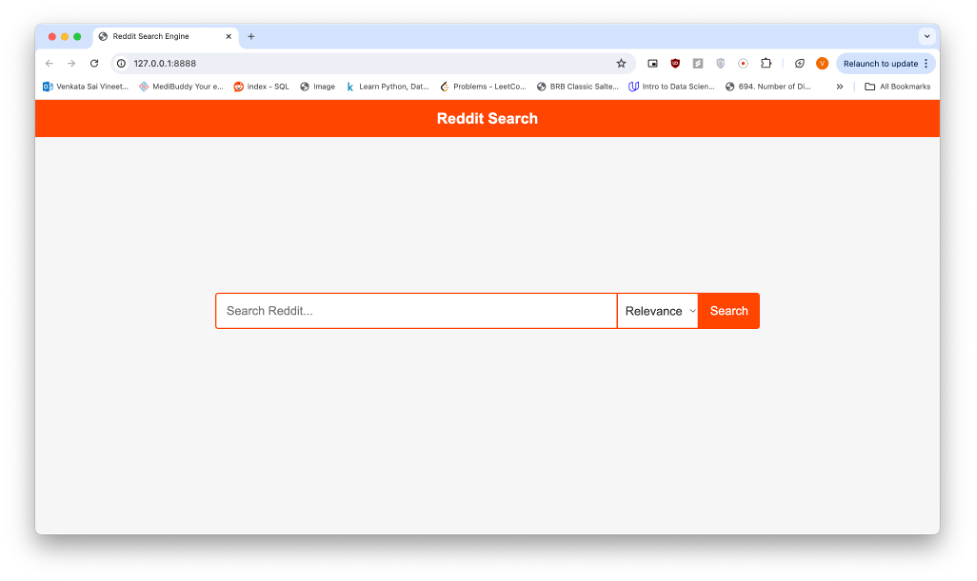

# Reddit Search Engine Web Application

## Table of Contents

- [Introduction](#introduction)
- [Motivation](#motivation)
- [Features](#features)
- [Architecture](#architecture)
- [Directory Structure](#directory-structure)
- [Installation](#installation)
- [Usage](#usage)
- [Technologies Used](#technologies-used)
- [Screenshots](#screenshots)
- [Contributing](#contributing)
- [License](#license)
- [Contact](#contact)

## Introduction

This is a full-stack Reddit Search Engine web application designed to efficiently crawl, index, and retrieve Reddit posts based on user queries. Users can search, filter, and sort Reddit posts by relevance or upvotes through a user-friendly interface.

## Motivation

With the abundance of valuable information on Reddit, a powerful and customizable search engine can help users quickly access relevant discussions, posts, and comments. This project provides more tailored search and ranking than Reddit's native search.

## Features

- **Automated Data Crawling:** Fetches posts and comments from specified subreddits using the Reddit API.
- **Efficient Indexing:** Leverages PyLucene for fast text search and custom ranking algorithms.
- **Flexible Searching:** Search posts by keywords, relevance, or upvotes.
- **User-Friendly UI:** Clean web interface built with Flask, Jinja2, HTML, and CSS.
- **Custom Ranking:** Option to sort by upvotes or a custom relevance metric.
- **Batch Data Management:** Supports batch crawling and indexing for large-scale data.
- **Screenshots:** Example screens are included below.

## Architecture

There are three stages in this application: **Crawling**, **Indexing**, and **Retrieving**.

### Stage 1 - Crawling

1. Crawls subreddit data using PRAW (Python Reddit API Wrapper).
2. `crawler.sh` invokes `reddit_crawler.py`. Pass subreddits as arguments.
3. Fetches top posts and comments based on configurable parameters.

### Stage 2 - Indexing

1. Uses PyLucene (Python extension for Apache Lucene) for indexing.
2. Supports custom analyzers for advanced text processing.
3. `create_index.py` processes Reddit data files for index creation.

### Stage 3 - Retrieving

1. PyLucene enables high-performance text search and ranking.
2. Supports sorting by upvotes or custom relevance function.
3. Returns top matching posts with scoring.

## Directory Structure

- `main.py`: Entry point for the Flask application.
- `reddit_data/`: Stores crawled Reddit data text files.
- `lucene_code/`: Contains Lucene indexing scripts.
  - `create_index.py`: Script for index creation and configuration.
  - `lucene_index/`: Directory for Lucene index files.
- `website/`:
  - `retrieve_data.py`: Data access layer for fetching/indexing Reddit data.
  - `views.py`: Handles routes, logic, and data flow to the frontend.
  - `static/`: CSS files for UI styling.
  - `templates/`: HTML templates using Jinja2.

## Installation

1. **Clone the repository:**
   ```bash
   git clone https://github.com/varunmedi/reddit-search-engine.git
   cd reddit-search-engine
   ```

2. **Install dependencies:**
   - Python 3.8+
   - [PRAW](https://praw.readthedocs.io/)
   - [Flask](https://flask.palletsprojects.com/)
   - [PyLucene](https://lucene.apache.org/pylucene/)
   - Other dependencies from `requirements.txt` (if present)
   ```bash
   pip install -r requirements.txt
   ```

3. **Configure Reddit API credentials:**
   - Create a `praw.ini` file or set environment variables with your Reddit API client ID, secret, and user agent.

## Usage

1. **Crawl Reddit data:**
   ```bash
   ./crawler.sh --subreddits subreddit1 subreddit2 --limit 100 --depth 5
   ```
2. **Create the index:**
   ```bash
   python3 lucene_code/create_index.py
   ```
3. **Run the Flask web app:**
   ```bash
   python3 main.py
   ```
4. Access the web app at `http://localhost:5000`

## Technologies Used

- **Backend:** Python, Flask, PyLucene, PRAW
- **Frontend:** HTML, CSS, Jinja2
- **Search Engine:** Apache Lucene (via PyLucene)
- **Shell Scripting:** Bash (`crawler.sh`)

## Screenshots

1. **Homepage:**  
   
2. **Search Results:**  
   

## Contributing

Contributions are welcome! Please open issues or submit pull requests for improvements. For major changes, please open an issue first to discuss your ideas.

This project is licensed under the MIT License. See the [LICENSE](./LICENSE) file for details.

## Contact

Created by [Varun Medi](https://github.com/varunmedi).  
For questions, open an issue or contact me via GitHub.
